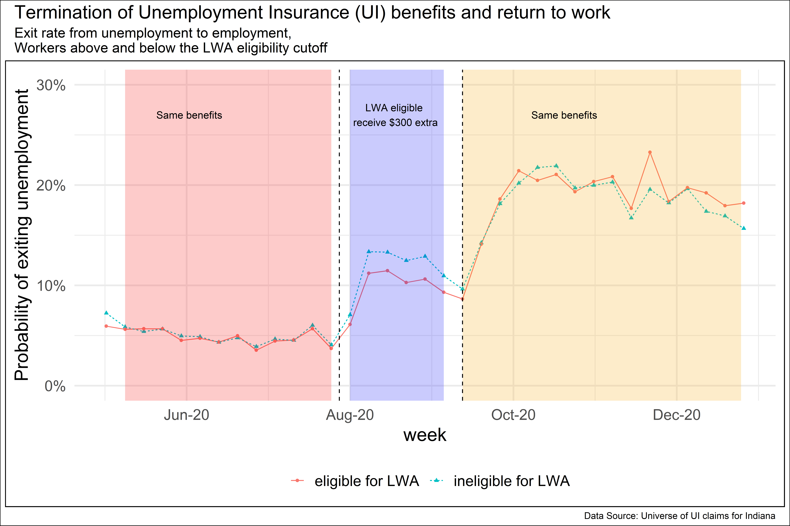

<!-- The one sentence description should make sense to a non-economist.  -->
## Published papers
**Motghare, S. (2021). [The long-run elasticity of labor supply: New evidence for new york city taxicab drivers.](https://www.sciencedirect.com/science/article/abs/pii/S0927537121000609) _Labour Economics_**
*New York City taxicab drivers worked fewer hours following a wage increase.*
<details>
  <summary>Abstract</summary>
I study how New York City taxicab drivers change their work hours in response to a permanent wage change. Exploiting the effective wage increase induced by a regulatory change in fares, I estimate the long-run elasticity of labor supply to be -0.5. I show that the data limitations may have biased the estimates in a previous study that also use data for New York City taxicab drivers. Since the drivers are almost exclusively males, the estimate likely represents male labor supply elasticity. The negative elasticity is consistent with rising wages and declining work hours per worker observed over many decades and is useful evidence for policymakers to improve tax/ transfer systems.\
</details> 

## Working papers
**[Contemporaneous and Lasting Effects of Electoral Gender Quotas](files/gender_quotas_paper.pdf) (_Revision submitted, World Development_)**\
*Gender quotas in India increased women representation without large negative effects.*
<details>
  <summary>Abstract</summary>
This paper examines several ways in which electoral gender quotas affect the political system. It uses data on reserved seat quotas for women in village councils in the Indian state of Jharkhand. Village council head positions subjected to gender quotas continue to elect more women even after the quotas are no longer binding. Gender quotas do not have spillover effects on other lower hierarchy positions in the council. They reduce electoral competitiveness, but only in the first round of elections and only at council member position. They do not affect the caste composition of the winning candidates. These results suggest that women’s representation may be achieved without large negative effects and that temporary electoral gender quotas can be an effective policy tool to increase long-run women’s political representation. The results are pertinent for affirmative action policies addressing other forms of discrimination.

</details> 

**[Unemployment insurance generosity and labor supply - Evidence from the COVID-19 recession](files/ui_labor_supply.pdf)**\
*Unemployment insurance during COVID-19 had a modest effect on Indiana's unemployment and likely prevented labor force exits.*
<details>
  <summary>Abstract</summary>
I study the effect of Unemployment Insurance (UI) generosity during the COVID-19 recession using administrative data on the universe of Unemployment Insurance claims for the state of Indiana. The difference-in-difference identification strategy exploits the timing of the expiration of the Federal Pandemic Unemployment Compensation (FPUC) and the Lost Wages Assistance (LWA) programs and the eligibility rule for the LWA program, which paid eligible workers an extra \$300 per week for up to 6 weeks. A change in weekly benefit amount by $300 is associated with a change in the exit rate out of unemployment by 2.1 percentage points
(p.p.) in the opposite direction. This is because of both a decline in the reemployment rate (1.7 p. p.) which represents the disincentive or the moral hazard effect of UI, and a decline in labor force exits (0.4 p. p.) which suggests the ability of UI to keep workers in the labor force or the labor force participation effect. Access to six weeks of increased benefit amounts did not change workers’ probability of switching employers, nor significantly affect their earnings after reemployment, suggesting worker-firm match quality was unaffected.
```{r echo=FALSE,out.width='100%', out.extra='style="float:center; padding:10px"'}

```
</details> 
<details>
  <summary>[Poster for AEA Annual Meeting](files/aea_poster.pdf)</summary>
</details> 


## Research in progress
**Equity of COVID-19-induced job loss duration**\
*How does the duration of unemployment during the COVID-19 pandemic vary by gender, race, and ethnicity?*

**Evaluating Right-to-Work laws, (with Ye Ji Kee and [Yong Suk Lee](https://keough.nd.edu/profile/yong-suk-lee/))**\
*How do RTW laws affect the labor market, automation technology adoption, and firm productivity?*

**Intertemporal Elasticity of Labor Supply for Taxicab drivers: Evidence using a new instrument**\
*Do workers work more when wages are high?*

## Policy reports
**[Impact Evaluation: City of South Bend Commuters Trust Program](files/ct_report.pdf), (with Danice Brown Guzmán)**\

## Dashboard development
**[South Bend Economy Database](https://lucyapps.shinyapps.io/sbeconomydb/)**

